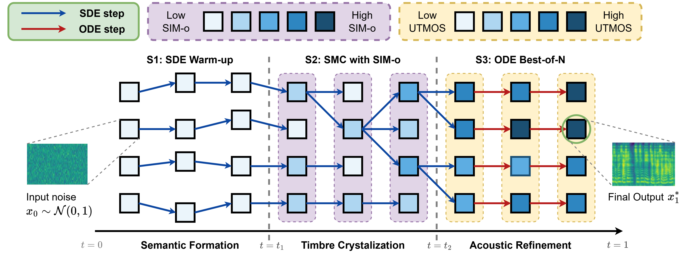

# TTS2: Test-Time Scaling for Flow-Based Text-to-Speech via Multi-stage Reward Modeling on Posterior Mean Projections

## 📑 Table of Contents
- [Response to Reviewer X4Ah](#response-to-reviewer-x4ah)
- [🌟 Demo for Reviewers](#-demo-for-reviewers)
  - [Abstract](#abstract)
  - [Model Overview](#model-overview)
  - [Zero-Shot Generation](#zero-shot-generation)
- [Installation](#installation)
- [Evaluation](#evaluation)
- [Single Sample Inference](#single-sample-inference-mrm-method)
- [Replicating Experiments](#replicating-experiments)
- [Acknowledgements](#acknowledgements)
- [Citation](#citation)
- [License](#license)

## Response to Reviewer X4Ah

> **W2: Sequential convergence only verified on large-scale models. Untested on smaller/structurally different models like Matcha-TTS.**

To address this, we have applied TTS^2 to Matcha-TTS and verified that the three-stage convergence pattern reproduces on this structurally different model. Detailed convergence analysis and plots addressing this concern can be found in the [`rebuttal`](rebuttal/) folder.

## 🌟 Demo for Reviewers

*(If you prefer a standalone web interface, you can still follow the instructions in [demo/README.md](demo/README.md) to run the interactive web demo).*

### Abstract
While training-time scaling has revolutionized generative models, inference-time compute scaling remains largely unexplored in speech synthesis. In this work, we investigate methods to effectively utilize computation during inference to improve the performance of non-autoregressive Text-to-Speech (TTS) systems, specifically those based on Conditional Flow Matching (CFM). By analyzing CFM synthesis behavior, we identify distinct performance plateaus during the denoising process. To overcome these limitations, we propose TTS<sup>2</sup> - a multi-stage, test-time compute framework that optimizes TTS quality. By combining Ordinary Differential Equation (ODE) and Stochastic Differential Equation (SDE) generation dynamics with stochastic search and specialized verifiers, our approach enables guided trajectory optimization for timbre consistency, content accuracy, and audio fidelity. To the best of our knowledge, this work is the first to formalize and study test-time scaling for non-autoregressive speech synthesis.

### Model Overview
<p align="center">
  
</p>
<p align="center">
  <em>Overview of TTS<sup>2</sup> (ours). Compute is aligned across the flow via a branching SDE search space. Trajectories begin with an unguided warm-up, refine speaker features through an SMC search, and converge using an ODE Best-of-N selection to finalize acoustic details.</em>
</p>

### Zero-Shot Generation

Compare the generated audio between F5-TTS and TTS<sup>2</sup> (ours) using the reference prompt. Both models are evaluated at NFE = 256.

| Reference & Gen Text | Reference Audio | F5-TTS | TTS<sup>2</sup> (ours) |
| :--- | :---: | :---: | :---: |
| **Ref:** You have been so ill, my poor Rachel.<br>**Gen:** Ill and troubled, dear - troubled in mind, and miserably nervous. | <audio controls><source src="demo/audio/ref/5683-32879-0008.flac" type="audio/flac"></audio> | <audio controls><source src="demo/audio/F5-TTS/5683-32879-0009.wav" type="audio/wav"></audio> | <audio controls><source src="demo/audio/TTS2/5683-32879-0009.wav" type="audio/wav"></audio> |
| **Ref:** No, my little son," she said.<br>**Gen:** That is a very fine cap you have," he said. | <audio controls><source src="demo/audio/ref/7021-85628-0026.flac" type="audio/flac"></audio> | <audio controls><source src="demo/audio/F5-TTS/7021-85628-0016.wav" type="audio/wav"></audio> | <audio controls><source src="demo/audio/TTS2/7021-85628-0016.wav" type="audio/wav"></audio> |
| **Ref:** Bracton's a very good fellow, I can assure you.<br>**Gen:** A cold, bright moon was shining with clear sharp lights and shadows. | <audio controls><source src="demo/audio/ref/5683-32866-0008.flac" type="audio/flac"></audio> | <audio controls><source src="demo/audio/F5-TTS/5683-32866-0027.wav" type="audio/wav"></audio> | <audio controls><source src="demo/audio/TTS2/5683-32866-0027.wav" type="audio/wav"></audio> |
| **Ref:** May you drink heart's ease from it for many years.<br>**Gen:** Yes. And with all your fingers it took you a year to catch me'. "The king frowned more angrily. | <audio controls><source src="demo/audio/ref/5142-33396-0050.flac" type="audio/flac"></audio> | <audio controls><source src="demo/audio/F5-TTS/5142-33396-0059.wav" type="audio/wav"></audio> | <audio controls><source src="demo/audio/TTS2/5142-33396-0059.wav" type="audio/wav"></audio> |
| **Ref:** Holmes held it out on his open palm in the glare of the electric light.<br>**Gen:** Well, well, don't trouble to answer. Listen, and see that I do you no injustice. | <audio controls><source src="demo/audio/ref/1580-141083-0036.flac" type="audio/flac"></audio> | <audio controls><source src="demo/audio/F5-TTS/1580-141084-0034.wav" type="audio/wav"></audio> | <audio controls><source src="demo/audio/TTS2/1580-141084-0034.wav" type="audio/wav"></audio> |
| **Ref:** Straightway the hawk glided from his perch and darted after him.<br>**Gen:** Once fairly a wing, however, he wheeled and made back hurriedly for his perch. | <audio controls><source src="demo/audio/ref/7176-88083-0016.flac" type="audio/flac"></audio> | <audio controls><source src="demo/audio/F5-TTS/7176-88083-0005.wav" type="audio/wav"></audio> | <audio controls><source src="demo/audio/TTS2/7176-88083-0005.wav" type="audio/wav"></audio> |
| **Ref:** And mine is Will Stuteley. Shall we be comrades"?<br>**Gen:** As any in England, I would say," said Gamewell, proudly. "That is, in his day. | <audio controls><source src="demo/audio/ref/61-70968-0039.flac" type="audio/flac"></audio> | <audio controls><source src="demo/audio/F5-TTS/61-70970-0011.wav" type="audio/wav"></audio> | <audio controls><source src="demo/audio/TTS2/61-70970-0011.wav" type="audio/wav"></audio> |
| **Ref:** Some poems of Solon were recited by the boys.<br>**Gen:** Many laws exist among us which are the counterpart of yours as they were in the olden time. | <audio controls><source src="demo/audio/ref/2961-961-0005.flac" type="audio/flac"></audio> | <audio controls><source src="demo/audio/F5-TTS/2961-961-0015.wav" type="audio/wav"></audio> | <audio controls><source src="demo/audio/TTS2/2961-961-0015.wav" type="audio/wav"></audio> |
| **Ref:** Is there not a meridian everywhere"?<br>**Gen:** But how did she manage to render it so fashionable"? | <audio controls><source src="demo/audio/ref/3729-6852-0025.flac" type="audio/flac"></audio> | <audio controls><source src="demo/audio/F5-TTS/3729-6852-0031.wav" type="audio/wav"></audio> | <audio controls><source src="demo/audio/TTS2/3729-6852-0031.wav" type="audio/wav"></audio> |
| **Ref:** And you belong to that small class who are happy!<br>**Gen:** This without reckoning in the pains of the heart. And so it goes on. | <audio controls><source src="demo/audio/ref/4507-16021-0050.flac" type="audio/flac"></audio> | <audio controls><source src="demo/audio/F5-TTS/4507-16021-0048.wav" type="audio/wav"></audio> | <audio controls><source src="demo/audio/TTS2/4507-16021-0048.wav" type="audio/wav"></audio> |
| **Ref:** Steam up and canvas spread, the schooner started eastwards.<br>**Gen:** Doubts now arose, and some discussion followed, whether or not it was desirable for Ben Zoof to accompany his master. | <audio controls><source src="demo/audio/ref/5105-28241-0003.flac" type="audio/flac"></audio> | <audio controls><source src="demo/audio/F5-TTS/5105-28240-0024.wav" type="audio/wav"></audio> | <audio controls><source src="demo/audio/TTS2/5105-28240-0024.wav" type="audio/wav"></audio> |
| **Ref:** One hardly likes to throw suspicion where there are no proofs".<br>**Gen:** Come, come," said Holmes, kindly, "it is human to err, and at least no one can accuse you of being a callous criminal. | <audio controls><source src="demo/audio/ref/1580-141083-0040.flac" type="audio/flac"></audio> | <audio controls><source src="demo/audio/F5-TTS/1580-141084-0033.wav" type="audio/wav"></audio> | <audio controls><source src="demo/audio/TTS2/1580-141084-0033.wav" type="audio/wav"></audio> |
| **Ref:** We had meters in which there were two bottles of liquid.<br>**Gen:** But the plant ran, and it was the first three wire station in this country". | <audio controls><source src="demo/audio/ref/2300-131720-0041.flac" type="audio/flac"></audio> | <audio controls><source src="demo/audio/F5-TTS/2300-131720-0024.wav" type="audio/wav"></audio> | <audio controls><source src="demo/audio/TTS2/2300-131720-0024.wav" type="audio/wav"></audio> |
| **Ref:** All the furniture belonged to other times.<br>**Gen:** It is an antipathy - an antipathy I cannot get over, dear Dorcas; you may think it a madness, but don't blame me. | <audio controls><source src="demo/audio/ref/5683-32866-0023.flac" type="audio/flac"></audio> | <audio controls><source src="demo/audio/F5-TTS/5683-32879-0018.wav" type="audio/wav"></audio> | <audio controls><source src="demo/audio/TTS2/5683-32879-0018.wav" type="audio/wav"></audio> |
| **Ref:** she asked impulsively, "I didn't believe you could persuade her, father".<br>**Gen:** Somehow, of all the days when the home feeling was the strongest, this day it seemed as if she could bear it no longer. | <audio controls><source src="demo/audio/ref/237-126133-0021.flac" type="audio/flac"></audio> | <audio controls><source src="demo/audio/F5-TTS/237-126133-0003.wav" type="audio/wav"></audio> | <audio controls><source src="demo/audio/TTS2/237-126133-0003.wav" type="audio/wav"></audio> |

## Installation

### Create a separate environment if needed

```bash
# Create a conda env with python_version>=3.10  (you could also use virtualenv)
conda create -n f5-tts python=3.11
conda activate f5-tts

# Install FFmpeg if you haven't yet
conda install ffmpeg
```

### Install PyTorch with matched device

<details>
<summary>NVIDIA GPU</summary>

> ```bash
> # Install pytorch with your CUDA version, e.g.
> pip install torch==2.8.0+cu128 torchaudio==2.8.0+cu128 --extra-index-url https://download.pytorch.org/whl/cu128
> 
> # And also possible previous versions, e.g.
> pip install torch==2.4.0+cu124 torchaudio==2.4.0+cu124 --extra-index-url https://download.pytorch.org/whl/cu124
> # etc.
> ```

</details>

<details>
<summary>AMD GPU</summary>

> ```bash
> # Install pytorch with your ROCm version (Linux only), e.g.
> pip install torch==2.5.1+rocm6.2 torchaudio==2.5.1+rocm6.2 --extra-index-url https://download.pytorch.org/whl/rocm6.2
> ```

</details>

<details>
<summary>Intel GPU</summary>

> ```bash
> # Install pytorch with your XPU version, e.g.
> # Intel® Deep Learning Essentials or Intel® oneAPI Base Toolkit must be installed
> pip install torch torchaudio --index-url https://download.pytorch.org/whl/test/xpu
> 
> # Intel GPU support is also available through IPEX (Intel® Extension for PyTorch)
> # IPEX does not require the Intel® Deep Learning Essentials or Intel® oneAPI Base Toolkit
> # See: https://pytorch-extension.intel.com/installation?request=platform
> ```

</details>

<details>
<summary>Apple Silicon</summary>

> ```bash
> # Install the stable pytorch, e.g.
> pip install torch torchaudio
> ```

</details>

### Then you can choose one from below:

> ### 1. As a pip package (if just for inference)
> 
> ```bash
> pip install f5-tts
> ```
> 
> ### 2. Local editable (if also do training, finetuning)
> 
> ```bash
> git clone https://github.com/SWivid/F5-TTS.git
> cd F5-TTS
> # git submodule update --init --recursive  # (optional, if use bigvgan as vocoder)
> pip install -e .
> ```

### Docker usage also available
```bash
# Build from Dockerfile
docker build -t f5tts:v1 .

# Run from GitHub Container Registry
docker container run --rm -it --gpus=all --mount 'type=volume,source=f5-tts,target=/root/.cache/huggingface/hub/' -p 7860:7860 ghcr.io/swivid/f5-tts:main

# Quickstart if you want to just run the web interface (not CLI)
docker container run --rm -it --gpus=all --mount 'type=volume,source=f5-tts,target=/root/.cache/huggingface/hub/' -p 7860:7860 ghcr.io/swivid/f5-tts:main f5-tts_infer-gradio --host 0.0.0.0
```


## [Evaluation](src/f5_tts/eval)

## Single Sample Inference (MRM Method)

To quickly test our MRM search method on a single sample, you need to run the reward server and the inference script:

1. **Start the reward server (in terminal 1)**:
```bash
CUDA_VISIBLE_DEVICES=0 REWARD_DEVICE=cuda python -m uvicorn paper_experiments.reward:app --host 127.0.0.1 --port 8000
```

2. **Run inference for one sample (in terminal 2)**:
```bash
CUDA_VISIBLE_DEVICES=0 python src/f5_tts/infer/infer_cli.py \
  --model F5TTS_v1_Base \
  --gen_text "This is a single sample test for the MRM search method." \
  --search_type mrm --search_n 8 --mrm_t1 0.35 --mrm_t2 0.8 \
  --reward_url http://127.0.0.1:8000/infer
```

> **Note on GPU Usage:** Both the reward server and the generation script are set to run on the same GPU (`CUDA_VISIBLE_DEVICES=0`). If you have multiple GPUs and want to run the reward server on a separate GPU to free up VRAM, you can change `CUDA_VISIBLE_DEVICES=1` when starting the reward server.

## Replicating Experiments

For full experiment sweeps (fixed t1/t2), baseline comparisons, and other evaluation details, please refer to the [Paper Experiments README](paper_experiments/README_mrm_experiment.md).


## Acknowledgements

- [E2-TTS](https://arxiv.org/abs/2406.18009) brilliant work, simple and effective
- [Emilia](https://arxiv.org/abs/2407.05361), [WenetSpeech4TTS](https://arxiv.org/abs/2406.05763), [LibriTTS](https://arxiv.org/abs/1904.02882), [LJSpeech](https://keithito.com/LJ-Speech-Dataset/) valuable datasets
- [lucidrains](https://github.com/lucidrains) initial CFM structure with also [bfs18](https://github.com/bfs18) for discussion
- [SD3](https://arxiv.org/abs/2403.03206) & [Hugging Face diffusers](https://github.com/huggingface/diffusers) DiT and MMDiT code structure
- [torchdiffeq](https://github.com/rtqichen/torchdiffeq) as ODE solver, [Vocos](https://huggingface.co/charactr/vocos-mel-24khz) and [BigVGAN](https://github.com/NVIDIA/BigVGAN) as vocoder
- [FunASR](https://github.com/modelscope/FunASR), [faster-whisper](https://github.com/SYSTRAN/faster-whisper), [UniSpeech](https://github.com/microsoft/UniSpeech), [SpeechMOS](https://github.com/tarepan/SpeechMOS) for evaluation tools
- [ctc-forced-aligner](https://github.com/MahmoudAshraf97/ctc-forced-aligner) for speech edit test
- [mrfakename](https://x.com/realmrfakename) huggingface space demo ~
- [f5-tts-mlx](https://github.com/lucasnewman/f5-tts-mlx/tree/main) Implementation with MLX framework by [Lucas Newman](https://github.com/lucasnewman)
- [F5-TTS-ONNX](https://github.com/DakeQQ/F5-TTS-ONNX) ONNX Runtime version by [DakeQQ](https://github.com/DakeQQ)
- [Yuekai Zhang](https://github.com/yuekaizhang) Triton and TensorRT-LLM support ~

## Citation

This project is built upon the original **F5-TTS** and **E2 TTS** codebases and architectures. If you use our work, please cite the original papers:
```
@article{chen-etal-2024-f5tts,
      title={F5-TTS: A Fairytaler that Fakes Fluent and Faithful Speech with Flow Matching}, 
      author={Yushen Chen and Zhikang Niu and Ziyang Ma and Keqi Deng and Chunhui Wang and Jian Zhao and Kai Yu and Xie Chen},
      journal={arXiv preprint arXiv:2410.06885},
      year={2024},
}

@article{e2tts-2024,
      title={E2 TTS: Embarrassingly Easy Fully Non-Autoregressive Zero-Shot TTS},
      author={Sheng, Tu and others},
      journal={arXiv preprint arXiv:2406.18009},
      year={2024}
}
```
## License

Our code is released under MIT License. The pre-trained models are licensed under the CC-BY-NC license due to the training data Emilia, which is an in-the-wild dataset.
